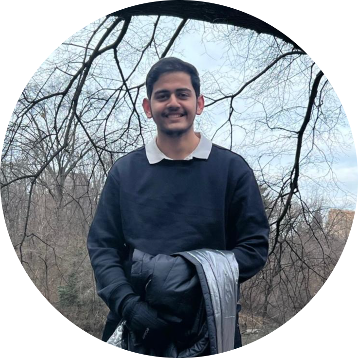

<h1 id="hi" class="section-title"><i class="fa-solid fa-user-graduate"></i> BIO</h1>

Hi there! I'm a PhD student at <a href="https://cse.osu.edu/">The Ohio State University</a> advised by <a href="https://khalilimahdi.github.io/">Prof. Mohammad Mahdi Khalili</a>. 
My current research focuses on interpretability and fairness in machine learning, aiming to make AI systems more transparent, and reliable, and socially responsible. Previously, I worked with <a href="https://www.paparrizos.org/">Prof. John Paparrizos</a> on projects at the intersection of data management and explainable AI. 
Before starting my Ph.D., I completed my Bachelor's degree in Computer Science at <a href="https://camden.rutgers.edu/">Rutgers University</a>, where I was mentored by <a href="https://www.cs.rutgers.edu/people/profile/rajiv" target="_blank">Prof. Rajiv Gandhi</a>. During my junior and senior years, I audited courses at the <a href="https://www.cis.upenn.edu/">University of Pennsylvania</a>, where I gained exposure in Machine Learning under <a href="https://www.seas.upenn.edu/~dineshj/">Prof. Dinesh Jayaraman</a> and <a href="https://www.cis.upenn.edu/~ungar/">Prof. Lyle Ungar</a>. 
Further, in my senior year, I also got an opportunity to intern at the <a href="https://eshed1.github.io/">H2X Lab</a> at <a href="https://www.bu.edu/">Boston University</a> under <a href="https://eshed1.github.io/">Prof. Eshed Ohn-Bar</a>, where I focused on robust vehicle keypoint detection under heavy occlusion and truncation. 
 

<h1 id="news" class="section-title"><i class="fa-solid fa-newspaper"></i> News</h1>

  <ul class="news-list">
    
      <li>
        <b>[{{ item.date }}]</b>  
        {{ item.text }}
      </li>
    
  </ul>

